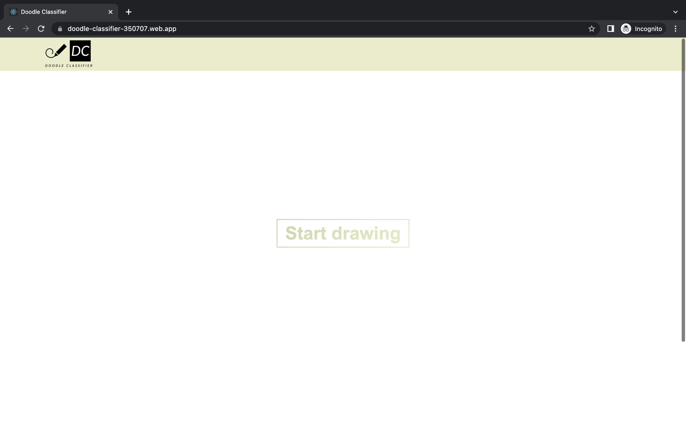
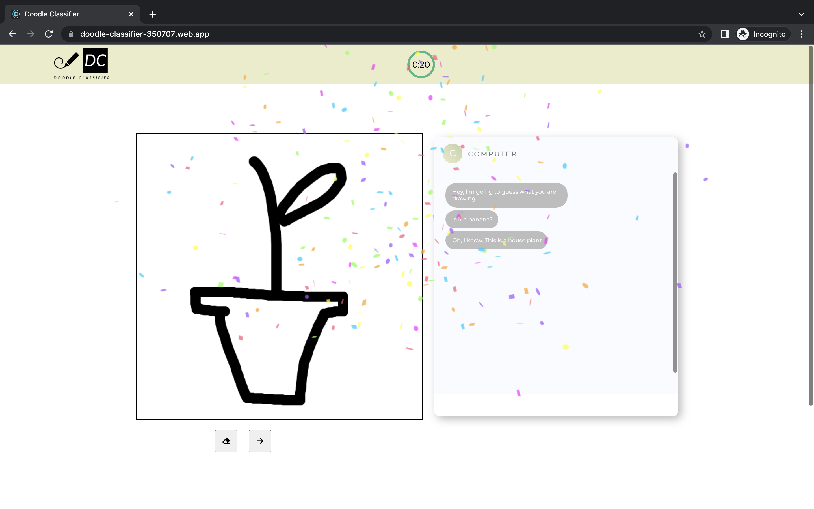
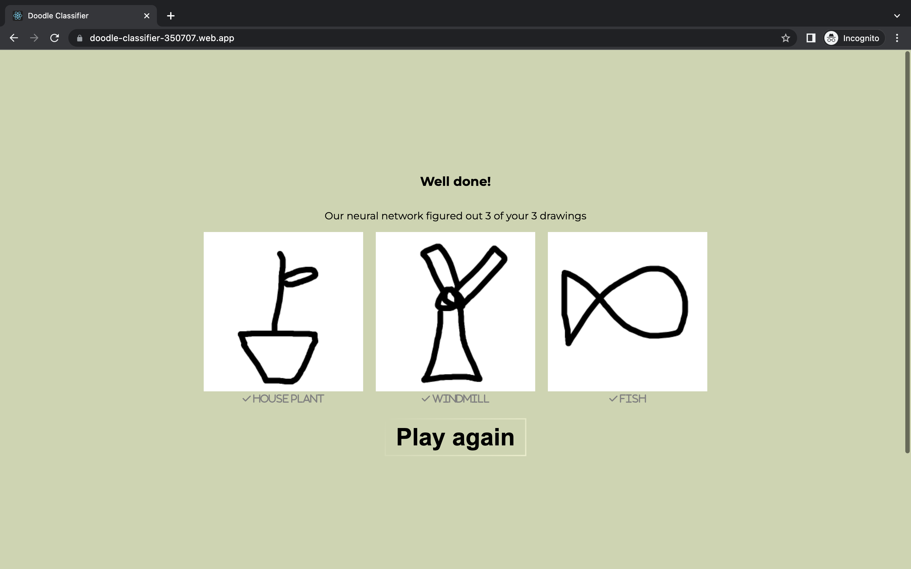

<div align="center">

 <br />

# Doodle-classifier-app


[Overview](#scroll-overview)
•
[Screenshots](#rice_scene-screenshot)
•
[URL](#computer-url)
</div>

## :bookmark_tabs: Menu

- [Overview](#scroll-overview)
- [Screenshots](#rice_scene-screenshot)
- [URL](#computer-url)
- [Requirements](#exclamation-requirements)
- [Folder Structure](#open_file_folder-folder-structure)
- [Author](#smiley_cat-author)

## :scroll: Overview

This web app enables users to draw doodles depending on a given prompt. A [deep learning algorithm](https://github.com/bryanlusse/doodle-classifier) predicts the class of the doodle while drawing. The aim of the game is to let the model correctly guess all drawings.

At the moment, 10 classes are supported. The prompt given for the drawings are therefore randomly drawn from these classes. The classes are: 'banana', 'calculator', 'cat', 'fish', 'hamburger', 'headphones', 'house', 'house plant', 'mushroom' and 'windmill'.

UPDATE 07-06-2022:
- Currently 30 classes are supported: 'apple', 'banana', 'basketball', 'cake', 'calculator', 'cat', 'chair', 'computer', 'cookie', 'crab', 'eye', 'fish', 'flower', 'hamburger', 'hat', 'pair of headphones', 'hockey stick', 'hourglass', 'house', 'house plant', 'mushroom', 'palm tree', 'pizza', 'potato', 'rainbow', 'spider', 'sword', 'syringe', 't-shirt', 'windmill'];

## :rice_scene: Screenshots
Home screen:

Drawing:

Drawings are shown at the end, and there is the option to play again.


## :computer: URL

https://doodle-classifier-350707.web.app/

## :exclamation: Requirements

- [React](https://reactjs.org/)
- [Google Cloud Platform](https://cloud.google.com/gcp/)
- [Firebase](https://firebase.google.com/)

## :open_file_folder: Folder Structure

```
.
├── package.json
├── package-lock.json
├── firebase.json
├── src                 # Folder with all web elements
│   ├── components
│   ├── context
│   ├── style
│   ├── typography
│   ├── Utils
│   ├── App.js
│   └── index.js
├── public
│   ├── index.html              
│   └── favicon.ico               
├── assets               # Images for the README
│   ├── logo.jpg
│   └── screenshot.png
└── README.md
```

## :smiley_cat: Author

- [@bryanlusse](https://github.com/bryanlusse)

Made with &nbsp;❤️&nbsp;